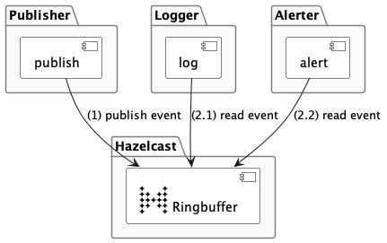

# hazelcast-ringbuffer-example



## Pre-Requisite: Running Hazelcast

```shell
docker run -p 5701:5701  hazelcast/hazelcast:latest
```

### How to update architecture graph?

```shell
plantuml architecture.puml 
```
